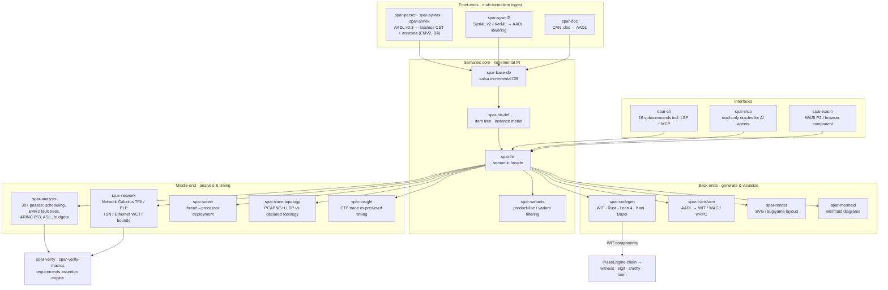

<div align="center">

# Spar

<sup>a compiler for system-architecture models</sup>

&nbsp;


[](https://github.com/pulseengine/spar/actions/workflows/ci.yml)
[](https://github.com/pulseengine/spar/actions/workflows/proofs.yml)
[](https://github.com/pulseengine/spar/actions/workflows/ci.yml)
[](https://codecov.io/gh/pulseengine/spar)

&nbsp;

<h6>
  <a href="https://github.com/pulseengine/meld">Meld</a>
  &middot;
  <a href="https://github.com/pulseengine/loom">Loom</a>
  &middot;
  <a href="https://github.com/pulseengine/synth">Synth</a>
  &middot;
  <a href="https://github.com/pulseengine/kiln">Kiln</a>
  &middot;
  <a href="https://github.com/pulseengine/sigil">Sigil</a>
  &middot;
  <a href="https://github.com/pulseengine/spar">Spar</a>
</h6>

</div>

&nbsp;

Spar is a **compiler for system-architecture models**, built on rust-analyzer's proven
architecture patterns. Like a programming-language compiler it has *front-ends* (parsers for
several modelling formalisms), a shared *intermediate representation* (an incremental,
salsa-backed HIR), a *middle-end* of analyses, and *back-ends* that emit code and diagrams —
except the "programs" it compiles are **system architectures**.

- **Front-ends — multi-formalism ingest.** AADL v2.3 (SAE AS5506D), SysML v2 / KerML, and
  CAN `.dbc` networks all lower into one semantic model. ARXML (AUTOSAR) is on the roadmap.
- **Middle-end — analysis & timing.** 30+ pluggable passes (scheduling, EMV2 fault trees,
  ARINC 653 partitioning, ASIL decomposition, resource budgets) plus a real-time
  **network-calculus** engine (TFA / PLP) that computes worst-case TSN/Ethernet latency bounds —
  the kind of timing analysis usually reserved for tools like tsnkit, RTaW-Pegase or pegase.
- **Back-ends — generate & visualize.** WIT/WASM components, Lean 4 and Kani proof skeletons,
  Bazel build files, SVG and Mermaid architecture diagrams.
- **Verified by construction.** Every capability is traced to a requirement (rivet artifacts),
  oracle-gated in CI, and exposed read-only to AI agents over MCP.

This is why it has outgrown the "AADL toolchain" label: AADL is one of several front-ends, and
the timing/verification middle-end is a substrate any architecture formalism can feed. Spar
replaces the Eclipse/Java OSATE2 toolchain with a fast, embeddable, WASM-compilable alternative —
and reaches well past what OSATE, or a single-formalism SysML v2 tool, covers.

## Components



## Installation

```bash
# From source
cargo install --git https://github.com/pulseengine/spar

# Or download a pre-built binary from releases
# https://github.com/pulseengine/spar/releases
```

## Quick Start

```bash
# Parse an AADL model and show the syntax tree
spar parse vehicle.aadl --tree

# List all declared items
spar items vehicle.aadl

# Instantiate a system hierarchy
spar instance --root Pkg::System.Impl vehicle.aadl test-data/sensor_lib.aadl

# Run all analysis passes
spar analyze --root Pkg::System.Impl vehicle.aadl test-data/sensor_lib.aadl

# Allocate threads to processors (deployment solver)
spar allocate --root Pkg::System.Impl vehicle.aadl test-data/sensor_lib.aadl

# Render the architecture as SVG
spar render --root Pkg::System.Impl -o arch.svg vehicle.aadl test-data/sensor_lib.aadl

# Run verification assertions
spar verify --root Pkg::System.Impl --rules rules.toml vehicle.aadl
```

## CLI Commands

| Command    | Description                                                  |
|------------|--------------------------------------------------------------|
| `parse`    | Parse AADL files and show syntax tree or errors              |
| `items`    | List declared packages, types, implementations               |
| `instance` | Build the system instance hierarchy                          |
| `analyze`  | Run all analysis passes (SARIF/JSON/text output)             |
| `allocate` | Solve thread-to-processor deployment bindings                |
| `diff`     | Compare two model versions for structural/diagnostic changes |
| `modes`    | Mode reachability analysis and SMV/DOT export                |
| `emit`     | Emit a Mermaid flowchart from an instantiated system         |
| `render`   | Generate SVG/HTML architecture diagrams                      |
| `verify`   | Evaluate verification assertions against the model           |
| `codegen`  | Generate code (WIT/Rust/Lean4/Kani/Bazel) from an instance   |
| `dbc`      | Ingest a CAN `.dbc` file and emit AADL (bus + devices)       |
| `moves`    | Hypothetical-rebinding oracle (verify a move under overlay)  |
| `insight`  | Compare CTF timing traces to Expected_BCET/WCET/Mean         |
| `lsp`      | Start the Language Server Protocol server                    |
| `mcp`      | Start the MCP server (read-only oracles for AI agents)       |

## Architecture

23 crates, organized as compiler stages — front-ends → IR → middle-end → back-ends:

```
Front-ends (ingest)
  spar-syntax         Lossless CST (rowan red-green trees) + typed AST
  spar-parser         AADL recursive-descent parser with error recovery
  spar-annex          AADL annex sublanguages (EMV2, BA, BLESS)
  spar-sysml2         SysML v2 / KerML parser + AADL lowering + requirements
  spar-dbc            CAN .dbc ingest -> AADL source text

Semantic core (intermediate representation)
  spar-base-db        Salsa database for incremental computation
  spar-hir-def        HIR definitions -- item tree, instance model, arenas
  spar-hir            Public semantic facade (name resolution, properties)
  spar-variants       Product-line variant selection and HIR filtering

Middle-end (analysis & timing)
  spar-analysis       30+ pluggable analysis passes
  spar-network        Network Calculus (TFA/PLP) -- TSN/Ethernet WCTT bounds
  spar-solver         Deployment solver (thread-to-processor allocation)
  spar-trace-topology Runtime vs declared topology (PCAPNG + LLDP + Qcc)
  spar-insight        Discrepancy assistant (CTF traces vs predicted timing)

Verification
  spar-verify         Requirements verification / assertion engine
  spar-verify-macros  Procedural macros for verification rules

Back-ends (generate & visualize)
  spar-codegen        Codegen from instance models (WIT, Rust, Lean4, Kani, Bazel)
  spar-transform      Format transforms (AADL <-> WIT, WAC, wRPC)
  spar-render         SVG architecture diagrams (compound Sugiyama layout)
  spar-mermaid        Mermaid diagram emission

Interfaces
  spar-cli            Command-line interface (16 subcommands incl. LSP + MCP)
  spar-mcp            Model Context Protocol server (read-only oracles)
  spar-wasm           WebAssembly component (WASI P2 / browser)
```

## Key Features

- **Multi-formalism ingest** -- AADL v2.3, SysML v2 / KerML, and CAN `.dbc` all lower into one semantic model (ARXML on the roadmap)
- **30+ analysis passes** -- scheduling, latency, connectivity, resource budgets, ARINC 653, ASIL, EMV2 fault trees, bus bandwidth, weight/power, mode reachability, and more
- **Network-calculus timing** -- worst-case TSN/Ethernet latency bounds via Total-Flow (TFA) and Polynomial-LP (PLP) analysis, cross-validated against the panco reference ([Bouillard](https://arxiv.org/abs/2010.09263))
- **Assertion engine** -- declarative verification rules in TOML (`spar verify`)
- **Deployment solver** -- automated thread-to-processor allocation with constraint satisfaction
- **Code generation** -- WIT/WASM components, Lean 4 + Kani proof skeletons, Bazel build files
- **AI-agent native** -- read-only verification oracles exposed over MCP (`spar mcp`)
- **SARIF output** -- analysis results in SARIF format for CI integration
- **VS Code extension** -- live rendering and diagnostics via LSP
- **WASM component** -- compiles to a wasm32-wasip2 component
- **Incremental** -- salsa-based memoization for fast re-analysis
- **Lossless parsing** -- every byte preserved in the syntax tree

## Editor support

A first-party VS Code extension lives in [`vscode-spar/`](vscode-spar/). It pairs the `spar lsp` server (diagnostics, hover, go-to-definition, completion, rename, inlay hints) with a live architecture-diagram webview that re-renders on save. See [`vscode-spar/README.md`](vscode-spar/README.md) for install + setup.

## Documentation

- [Quickstart](docs/quickstart.md) -- build spar, parse + analyze the sample model in ~30 minutes
- [`spar moves` reference](docs/cli/moves.md) -- hypothetical-rebinding oracle (verify + enumerate)
- [WASM-as-architecture design](docs/plans/2026-03-10-wasm-as-architecture-design.md) -- WIT/WAC/wRPC transforms
- [VS Code extension design](docs/plans/2026-03-18-vscode-extension-design.md) -- editor integration
- [Deployment solver plan](docs/plans/2026-03-21-deployment-solver-plan.md) -- allocation algorithm

## Safety

Full STPA (System-Theoretic Process Analysis) safety analysis:

- [STPA analysis](safety/stpa/analysis.yaml) -- losses, hazards, UCAs, loss scenarios
- [Safety requirements](safety/stpa/requirements.yaml) -- 23 STPA-derived requirements
- [Rivet artifacts](artifacts/) -- requirements, architecture decisions, verification records

## License

MIT License -- see [LICENSE](LICENSE).

---

<div align="center">

<sub>Part of <a href="https://github.com/pulseengine">PulseEngine</a> -- formally verified WebAssembly toolchain for safety-critical systems</sub>

</div>
