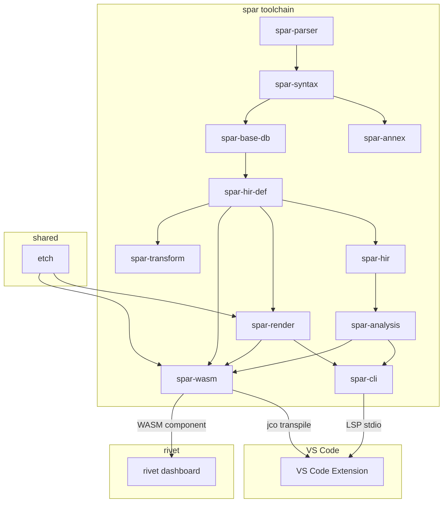

# spar — AADL v2.2 Toolchain

spar is a Rust-based toolchain for the Architecture Analysis & Design Language
(AADL, SAE AS5506C). It provides parsing, semantic analysis, safety analysis,
and interactive architecture visualization for safety-critical system design.

## Architecture



## Crates

| Crate | Purpose |
|-------|---------|
| `spar-parser` | AADL v2.2 lexer and parser |
| `spar-syntax` | Lossless CST via rowan |
| `spar-annex` | EMV2 and behavior annex parsing |
| `spar-base-db` | Salsa incremental computation database |
| `spar-hir-def` | HIR definitions: item tree, instance model, properties |
| `spar-hir` | Public HIR facade with serde serialization |
| `spar-analysis` | 21 analysis passes (scheduling, latency, connectivity, etc.) |
| `spar-render` | SVG/HTML rendering via etch compound layout |
| `spar-transform` | WIT/WAC/Rust crate transforms |
| `spar-cli` | CLI (`spar parse/items/instance/analyze/render/modes/verify/lsp`) |
| `spar-wasm` | WASM component (wasm32-wasip2) for rivet integration |
| `etch` | Shared graph layout + SVG rendering engine (in rivet repo) |

## Key Features

- **Full AADL v2.2 parser** with error recovery and lossless syntax tree
- **21 analysis passes** including RMA scheduling, latency, EMV2 fault trees, mode reachability
- **Port-aware rendering** with orthogonal edge routing and interactive HTML
- **LSP server** with 10 IDE features (diagnostics, hover, completion, go-to-def, rename, etc.)
- **WASM component** for browser-side rendering in rivet dashboard
- **VS Code extension** with syntax highlighting, LSP, and live diagram webview
- **Lean4 formal proofs** for scheduling theory (RTA convergence, RM bound)
- **Requirements verification** via `spar verify` with TOML-based thresholds

## CLI Commands

```
spar parse      [--tree] <file...>                              Parse and report diagnostics
spar items      [--format text|json] <file...>                  Show declarations
spar instance   --root Pkg::Type.Impl [--analyze] <file...>     Instantiate system
spar analyze    --root Pkg::Type.Impl [--format text|json] <file...>  Run analyses
spar render     --root Pkg::Type.Impl [--format svg|html] [-o out] <file...>  Render diagram
spar modes      --root Pkg::Type.Impl [--format text|smv|dot] <file...>  Mode analysis
spar verify     [--format text|json] --root Pkg::Type.Impl req.toml <file...>  Check requirements
spar lsp                                                         Start LSP server
```

## Safety Traceability

spar uses rivet for lifecycle artifact management:

```
STPA Analysis (analysis.yaml)
  → Safety Requirements (requirements.yaml, rendering-analysis.yaml)
    → Architecture Decisions (architecture.yaml)
      → Verification Evidence (verification.yaml)
```

All safety requirements are traced from hazard analysis through implementation
to test evidence. See `safety/stpa/` and `artifacts/` directories.
